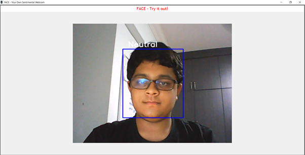
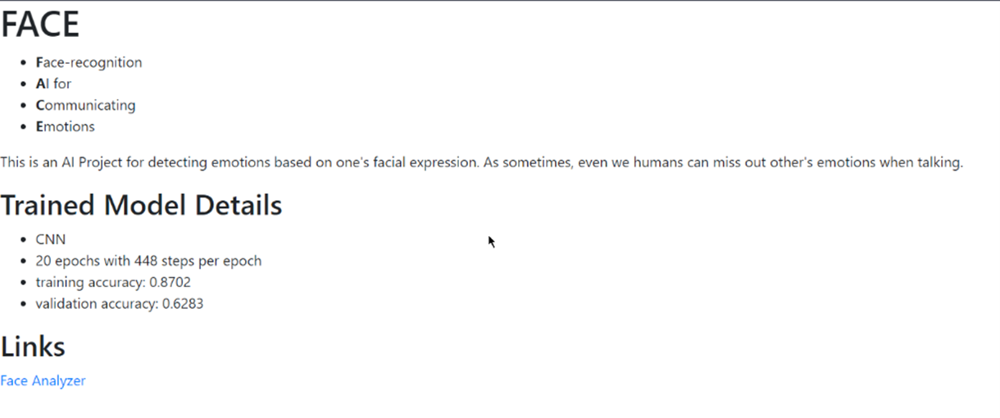

# FACE


- **F**ace-recognition
- **A**I for
- **C**ommunicating
- **E**motions

This is an AI Project for visual sentiment analysis based on audiences' **Face**.

This application will be an indispensable tool for movie-makers *FACE*ing problems with getting honest feedback about thier productions through text.
With **FACE**, they will be able to view thier audience's reactions and will get essential information to improve thier movie production, using deep learning!

For our report, look [here](https://github.com/ThePyProgrammer/AIWinpetition3_7_FACE/blob/main/FACE%20-%20Report%20for%20BuildingBloCS%202021.pdf).

## Our Idea
The theme we have chosen is “Inspired by Hollywood”. This project aims to enable our program to detect the target's feelings, and gauge their satisfaction when watching a film. This will allow the film directors to know how the audience is taking the film. For example, when watching a film, a director can quickly know the audience's engagement and feeling. This allows him to be able to see how his or her film is in the eyes of the audience. With this program, through facial expressions, the director can quickly receive feedback, allowing for more accurate and quick feedback on the emotional rollercoaster that the audience is in. With our Face-recognition AI for Communicating Emotions (FACE), you will never have to FACE this problem again!


## Our Rationale

This application has been built off against the theme of “Inspired by Hollywood”. An unfortunate situation in Hollywood, and by extension the entire world, is the apparent lack of transparency. While one might say the opaqueness gives one a sense of security and the feeling of personal space, this becomes abundantly problematic with Peer Pressure and Societal Expectations.

Imagine a world where no one hides their emotions. Everyone is 100% transparent with one another, and no one lies. While such a world may only seem to exist in concept films like The Invention of Lying and short videos by Ryan George, the truth is that this world yields certain benefits, benefits which may affect how one works or adapts to the situation. 

Take a simple example of a project at school, where one person is doing all the work while the rest slack. Now, the person can either say the complete truth and express his discomfort or hide his emotions and work on the entire project, wasting his time in the process. As the situation is, you can’t really be rooting for the option of hiding your emotions, can you? But 99% of the time, that is what the person would do, because they don’t want to be misjudged or looked at in a negative light. The societal perceptions and pressures become a bane to their very honesty.

A macroscopic example of this comes in the form of movie reviews. Critics may choose to be less harsh on a movie if they don’t want to make the director and the cast feel bad, and that is the reason that honest reviews are needed more than ever now. But that’s the problem. You can’t get honest reviews easily. Hiding your emotions will always take over. That’s why FACE was made.

FACE aims to fix this problem, by enabling a facial recognition-based sentiment analysis system. Simply put, it takes in your FACE and classifies it using a CNN to a certain emotion. That is how you felt during the encounter. This allows directors to quickly gauge how one’s feeling and engagement regarding a movie, so that they can work to tie up loose ends. It’s essentially allowing the director to fill the audience members’ shoes and understand how things work from their perspective. This technology being online also allows sentiment analysis on online platforms similar to Zoom, which makes being in the same room not as important. A possible option that arises from that is lie detection, especially during interviews.

All in all, this application will be an indispensable tool for moviemakers facing problems with getting honest feedback about their productions through text. With FACE, they will be able to view their audiences’ reactions and will get essential information to improve their movie production, using deep learning! This technology aims to allow not only you, but everyone around you, to express yourselves as you are, not as society wants you to be. Didn’t like Captain Marvel? You can be vocal about it, don’t worry. We are with you every step of you to help you FACE your fears.

## The Model
We trained a Convolutional Neural Network (CNN) against a dataset that we had with us. We trained the CNN, which was developed via the following prototype emotion model code written in TensorFlow Keras with Python:

<p align="center">
 
</p>

The model takes in a grayscale version of the image and returns the probability function. This was as part of our research, where previous papers and examples showed this to be the most accurate model found so far. We then used an Adam optimizer with a learning rate of `0.0001` and decay of `10-6`, basing our training system on the accuracy of the model. Over `50` epochs, we were able to get a final product with training accuracy of `87.02%` and validation accuracy (testing accuracy) of `62.83%`.


## Software Development

Following the development of our model, we went ahead to separate our system into two separate segments: a Desktop Client coded in Tkinter with Python and a Web Client coded in Flask with Python and HTML.


### The FACE Desktop Client
Our desktop accesses the Webcam footage of a user to analyze faces and, based off each face, run it through the CNN. The CNN returns a dictionary containing the probability of each emotion being the case. To make the User Interface simpler for the user, our desktop client only displayed the most likely emotion. This emotion is displayed along with a rectangle that is displayed on top of the face, as found by OpenCV. The following is the simplistic UI of the Desktop Client:

<p align="center">
 
</p>

#### To Run
To run, please run `face-tkinter/main.py` using the python interpreter.

```sh
pip install -r requirements.txt
```

##### Options

```sh
python facetk/main.py
```

or

```sh
py facetk/main.py
```

or

```sh
/path/to/python/interpreter/python.exe facetk/main.py
```

### The FACE Web Client
The web client, developed with the Flask Web Framework, was developed as a prototype due to time constraints and the difficulty of integrating the front-end of the web application with the backend. The prototype captures the essence of FACE and utilises the CNN to its best ability. A user-friendly web interface first asks you to take a photo of yourself or upload a pre-existing photo which is saved as a .jpg or .png file. Following this, the analyzer can be used by clicking on the link provided and pressing a button shown, prompting one to select the image from the hard drive. Following this, pressing the submit button allows the website to run the image through the CNN model, allowing it to guess your emotion based on a facial expression. Although simplistic, under the hood lies a great Machine Learning model with a lot of untapped potential, which we believe sets it apart from other metrics.

<p align="center">
 
 Figure: Analyzer Page
</p>


<p align="center">
 
 Figure: Classification Page
</p>


<p align="center">
 
 Figure: README Page
</p>


## Technical Specifics
### Clone with

```bash
git clone git@github.com:RenoirTan/beebeesee-2021.git
```

### Setup using

**NOTE: Dlib uses a lot of resources for compilation and might crash your computer.**

#### Unix (SU)

```bash
bash ./setup.sh
```

#### Windows (SU)

```shell
./setup.cmd
```

### Running the website in debug mode

#### Unix (RWDM)

```bash
bash ./debug.sh
```

### Windows (RWDM)

```shell
./debug.cmd
```
